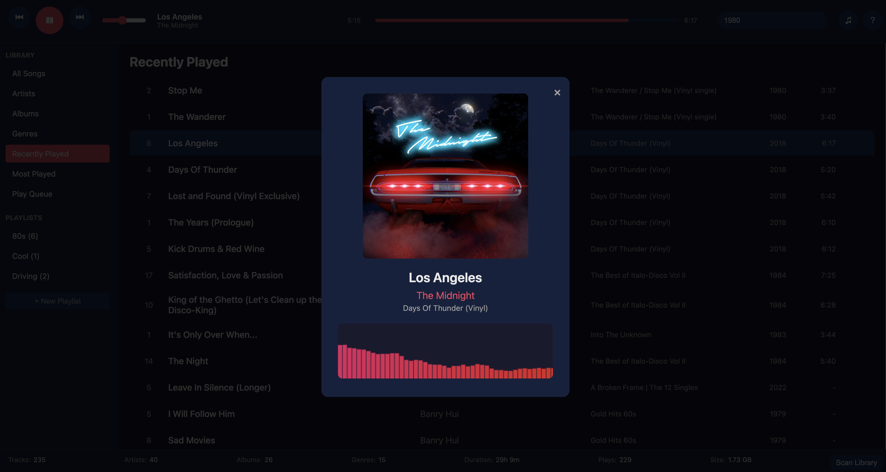

# NeonAMP - Your Retro-Futuristic MP3 Player



**Turn your browser into a glowing 80s music machine!** NeonAMP is a **self-hosted, single-file MP3 player** that combines the nostalgia of vintage audio gear with modern web tech. Built with **PHP 8.3+**, **Vanilla JS**, and **SQLite**, it's like having a **synthwave jukebox** in your browser.

## Why NeonAMP?

✅ **Instant Setup** - Just drop your MP3s in and go (no database config!)
✅ **DJ-Style Crossfade** - Smooth 3-second transitions between tracks
✅ **Full ID3 Tag Support** - Auto-indexes your music with album art
✅ **Keyboard Control** - Play/pause, skip, volume - all at your fingertips
✅ **No Framework Bloat** - Pure PHP + JS (under 100KB!)
✅ **Retro UI** - Glowing waveforms, big album art, and 80s vibes

## Quick Start

```bash
git clone https://github.com/marchildmann/NeonAMP.git
cd NeonAMP
mkdir music && cp ~/Music/*.mp3 music/
php -S localhost:8000
```

**Boom!** Open [http://localhost:8000](http://localhost:8000) and let the neon waves begin.

### Library Management
- Auto-scans MP3 files with **full ID3v1/ID3v2 tag support**
- Browse by **Artists, Albums, Genres, or Recently Played**
- **Playlists** that actually work (create, rename, delete)

### Playback Power
- **DJ-style crossfade** (3-second seamless transitions)
- **Play Queue** system (add tracks to play next)
- **Audio visualizer** with glowing effects

### Keyboard Shortcuts
| Key | Action |
|-----|--------|
| `Space` | Play/Pause |
| `←`/`→` | Previous/Next |
| `↑`/`↓` | Volume Up/Down |
| `M` | Mute |
| `N` | Now Playing View |
| `?` | Show Help |

## Tech Stack

- **Single-file PHP** (everything in `index.php`)
- **SQLite database** (auto-generated, no setup)
- **Web Audio API** for pro-level audio control
- **Native ID3 parsing** (no external dependencies)

## Project Structure

```
NeonAMP/
├── index.php        # The whole app!
├── music/           # Your MP3s go here
├── library.sqlite   # Auto-created database
└── README.md        # You're reading it!
```

## License

MIT - Free as in **radical**.

---

**Star this repo if you want more retro music tools!**
```